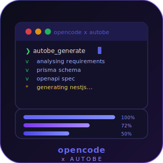

# opencode-autobe

<p align="center">
  
</p>

An [OpenCode](https://opencode.ai) plugin that integrates [AutoBE](https://autobe.dev) — the AI-powered NestJS + Prisma backend generator — directly into your OpenCode sessions.

## What it does

Adds three tools to OpenCode:

| Tool | Description |
|------|-------------|
| `autobe_generate` | Generate a complete NestJS + Prisma backend from a natural-language description |
| `autobe_list_sessions` | List recent AutoBE sessions on your playground server |
| `autobe_get_files` | Retrieve generated files from a completed session and write them to your project |

## Prerequisites

1. **AutoBE playground server** — clone [autobe](https://github.com/samchon/autobe) and run the playground server
2. **AI API key** — Anthropic, OpenAI, or any OpenAI-compatible provider

## Installation

### As an npm plugin (recommended)

Add to your `opencode.json`:

```json
{
  "plugins": ["opencode-autobe"]
}
```

### Local development

Clone this repo and place the project in your working directory. OpenCode will auto-load `.opencode/plugins/autobe.ts`.

## Configuration

Set these environment variables before starting OpenCode:

| Variable | Default | Description |
|----------|---------|-------------|
| `AUTOBE_SERVER_URL` | `http://localhost:3000` | AutoBE playground server URL |
| `AUTOBE_API_KEY` | — | API key for the AI vendor (overrides other keys) |
| `ANTHROPIC_API_KEY` | — | Anthropic API key (used if `AUTOBE_API_KEY` not set) |
| `OPENAI_API_KEY` | — | OpenAI API key (used as last fallback) |
| `AUTOBE_BASE_URL` | — | Custom base URL for OpenAI-compatible endpoints |
| `AUTOBE_MODEL` | `claude-sonnet-4-20250514` | Default AI model |
| `AUTOBE_VENDOR_ID` | — | Skip vendor creation, use this existing vendor ID |

## Usage

Once configured, just describe your backend in natural language:

```
Generate a backend for a blog platform with posts, comments, tags, and user auth
```

OpenCode will call `autobe_generate` and run the full AutoBE pipeline:

1. **Requirements analysis** — structures your description into a formal spec
2. **Database design** — creates a type-safe Prisma schema
3. **API design** — generates an OpenAPI specification
4. **Test generation** — writes E2E test suites
5. **Code generation** — produces compilable NestJS implementation

All generated files are written to your current project directory.

## AutoBE pipeline

AutoBE uses a waterfall + spiral architecture with compiler-driven validation:

```
Requirements → Prisma Schema → OpenAPI Spec → E2E Tests → NestJS Implementation
     ↑               ↑               ↑             ↑               ↑
  Analyze         Database        Interface       Test           Realize
```

Each phase validates against its compiler (Prisma → OpenAPI → TypeScript) before proceeding.

## Starting the playground server

```bash
# Clone autobe
git clone https://github.com/samchon/autobe
cd autobe

# Install dependencies
pnpm install

# Set up database
cd apps/playground-server
npx prisma db push

# Start the server (default port from .env.local)
pnpm exec ts-node src/executable/server.ts
```

Set `AUTOBE_SERVER_URL` to the server's address and port.

## License

MIT
